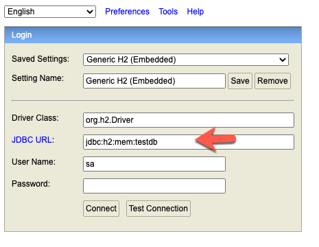
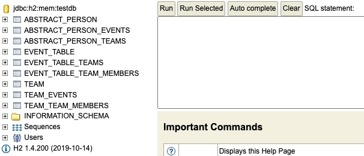

# volley-manager

Volleyball Team Manager

Dieses Projekt soll es einem Volleyball-Verein ermöglichen möglichst einfach alle Daten zu verwalten. Es basiert auf Java/Spring-Boot für das Backend und Angular für das Frontend. Als Datenbank wird mysql verwendet.

Folgende Funktionalitäten sind geplant:

- Verwaltung von Mitgliederdaten (Spieler/innen, Trainer/innen, Kontaktpersonen)
- Verwaltung von Teams
- Verwaltung von Anlässen (Trainings, Spiele)

Das Packet basiert auf Java 17.

Ein paar Postman comands um das API zu testen:
https://www.getpostman.com/collections/d0025a19e309e78f03f1

## ToDos

- Authentifizierung (Spring Security und in Angular)

## Zugriff auf H2-Konsole (bei aktivem H2 Profil)

Der Inhalt der DB kann wie folgt betrachtet werden:

[http://localhost:8080/h2-console ](http://localhost:8080/h2-console)

 

 

 

## Zugriff auf Swagger UI

[http://localhost:8080/swagger-ui.html](http://localhost:8080/swagger-ui.html)

## Download der Swagger YAML Datei

[http://localhost:8080/v3/api-docs.yaml](http://localhost:8080/v3/api-docs.yaml)
 -> yaml file is downloaded -> [https://editor.swagger.io/](https://editor.swagger.io/)
 
 ## Das Paket ist Docker-Ready

